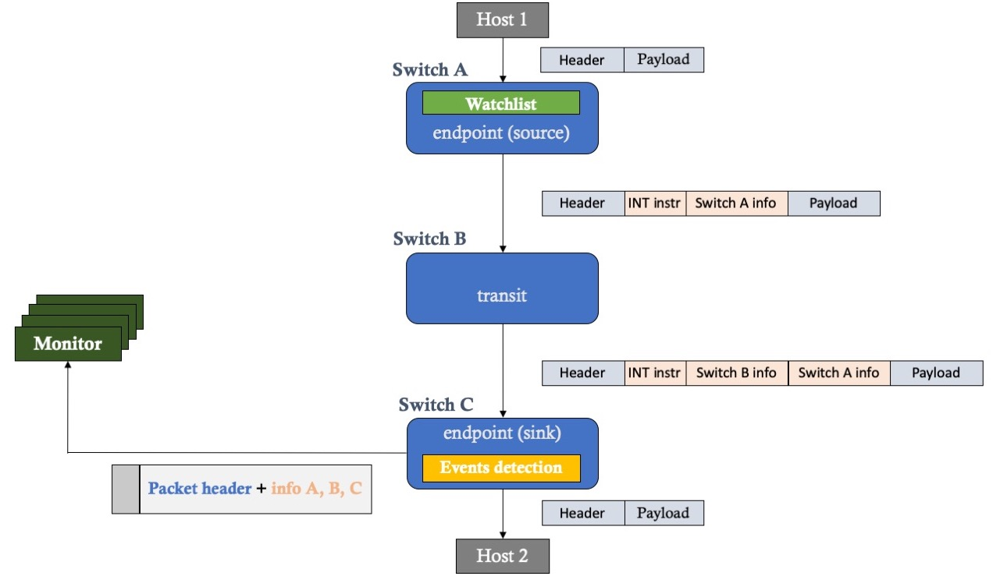
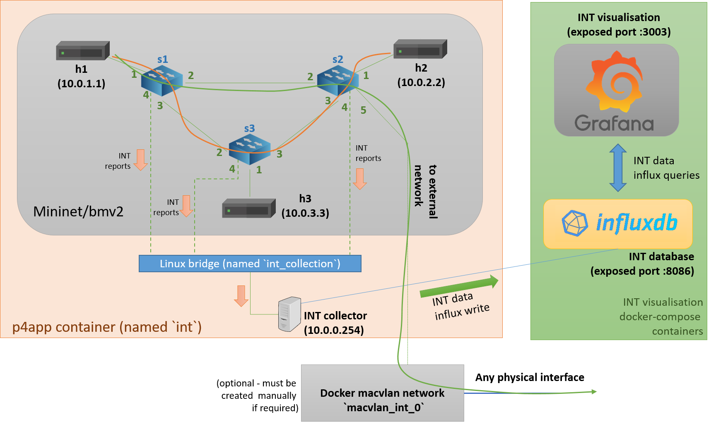

P4 INT implementation for bmv2 switches running within mininet environment.
===========================================================================

This is P4 implementation of the In-Band Network Telemetry (https://p4.org/specs/). The P4 INT is deployed using testbed composed of three bmv2 switches running within Mininet virtual enviroment.
The whole environment is provided basing on p4app solution (https://github.com/p4lang/p4app).

The INT implementation and testing was done within the GEANT Data Plane Programmibilty activity:
* https://wiki.geant.org/display/NETDEV/INT

All INT code (P4 INT, INT collector, additinal mininet utils) use Apache 2.0 licence.


In-Band Network Telemetry
------

In-Band Network Telemetry (INT)  is specified by the P4 language community and can provide very detailed information on network behavior by inserting a small amount of information directly inside packets passing
through network devices where INT functionality is enabled, essentially adding probing functionality to potentially every packet, including customer traffic. 
This makes INT a very powerful debugging protocol, capable of measuring and recording the 'experience' of each tagged packet sent in the network.




P4 implementation of INT
------

This repository contains P4 code implementing the INT data plane functionality. Initially the P4 INT code was developped only for bmv2 but later on it was also adapted for Tofino switches. 
In this repository, we are trying maintain compatibility both with bmv2 and Tofino switches. Limitations of both platforms have impact on the P4 INT code.

A few flavors of INT implementation are available:
- ./int.p4app/int_v0.4.json - version 0.4 of the INT protocol; currently most tested version of the INT protocol; it is compatible with the INT implementation contained in the ONOS network operating system; INT version 0.4 documentation is not longer available on p4.org
- ./int.p4app/int_v1.0.json - version 1.0 of the INT protocol; under development

Future plans assumes implementation of the INT specification version 2.0.


INT collector
----
It is simple, pure Python based implemtation of the INT collector suitable for very low packet rate of monitored flows (on our hardware, we can generate no more that 2000 packets per second of total traffic within p4app virtual environment).
The implementation of the INT collector can be found at the following location: `int.p4app/scripts/int_collector_influx.py`. The INT collector is started automatically by INT p4app.

In order to configure desire InfluxDB destination for INT monitoring data please edit proper p4app manifest file (in example: `./int.p4app/int_v0.4.json`):

```
{
	"program": "p4src/int_v0.4/int.p4",
	"language": "p4-16",
	"targets": {
		"custom": {
			"program": "topo.py --int_version=0.4 --influx hs-04.ipa.psnc.pl:8086"
		}
	}
}
```

Currently INT collector can parse INT reports version 1.0 and can extract INT metadata added by bmv2 switches (INT collectors supports versions 0.4 and 1.0 of the INT protocol headers).

p4app
-----

p4app is a tool that which can be used to build, run, debug, and test P4 programs. The philosophy behind p4app is "easy things should be easy" - p4app is designed to make small, simple P4 programs easy to write and easy to share with others.


Installation
------------

1. Install [docker](https://docs.docker.com/engine/installation/) if you don't already have it.

2. If you want, put the `p4app` script somewhere in your path. For example:

    ```
    cp p4app /usr/local/bin
    ```
    
I have already modified the default docker image to **baru64/int_p4app**, so `p4app` script can be used directly without need to build a p4app docker image with all additional libraries (which can be problematic).
For more information about p4app please visit: https://github.com/p4lang/p4app


INT p4app package
------------------------

Our INT p4app package has a directory structure that looks like this:

```
  int.p4app
    |
    |- commands/  (bmv2 Thrift CLI configuration commands for each bmv2 switch)
    |
    |- host/   (python scripts that can be run on mininet host in order to send/receive network traffic)
    |
    |- libraries/   (additional libraries that are installed in p4app after container start)
    |
    |- p4src/   (P4 INT code for bmv2)
    |
    |- utils/   (additional utility scripts allowing to debug bmv2 switch, connect to bmv2 CLI, open mininet host xterm, INT collector is also placed here)
    |
    |- int_v0.4.json   (p4app config file for INT version 0.4)
    |
    |- int_v1.0.json   (p4app config file for INT version 1.0)
    |
    |- topo.txt  (defines topology of the mininet network)
    |
    |- topo.py (python program that use `topo.py`, run custom mininet network and apply configuraton to bmv2 switches;
                    it also create INT collection network and start the INT collector; 
                    it is also responsible for establishing of the external network connectivity)

```


Testbed
----------------------------------
Our INT virtual environment is composed by three bmv2 switches running within Mininet. The adopted triangular topology is shown below. Each switch connects to a host, and the flows in the network are identified by {srcIP, srcPort, dstIP, dstPorts} tuple.
Additionally, to each bmv2 switch is connected a link (linux veth) to linux bridge which gathers all INT reporting traffics. All INT reports are send to the INT collector which parse INT report header, INT headers and extract INT metadata for each passed switch.
INT metadata are then stored in the INT Influx database independently deployed using https://github.com/GEANT-DataPlaneProgramming/In_band_telemetry_visualisation. 




Additionally, it possible to connect external network to the mininet network at bmv2 switch named `s2` (port 5) by manually creating docker macvlan network which should be called `macvlan_int_0`.
`p4app` script is responsible for automatic detection of that network and connecting proper macvlan interface to the 'int' container. Macvlan interface is available as `eth1` within a running container. 
Existance of `macvlan_int_0` is not mandatory to run and use INT p4app.
From our experiance, it is easier to enable traffic leaving mininet to external network than succesfully enabling incoming traffic from external network to mininet.
Please check the example in which macvlan network `macvlan_int_0` is connected to the physical port`eth1`:

```
sudo docker network create -d macvlan \
    --subnet=172.19.0.0/16 \
    --ip-range=172.19.0.0/24 \
    --gateway=172.19.0.1 \
    -o macvlan_mode=bridge \
    -o parent=eth1 macvlan_int_0

```
 
 If you want connect more external network please check `p4app` bash script. If you want change to which bmv2 switch external network is connected to please look at `topo.py`.


Usage
-----

In order to run specific version of P4 INT code please use proper manifest file:

```
p4app run int.p4app -- manifest int_v1.0.json
```

If you run this command, you'll find yourself at a Mininet command prompt. p4app will automatically download a Docker image containing the P4 compiler and tools,
compile P4 code, and set up a container with a simulated network you can use to experiment. 
In addition to Mininet itself, you can use `tshark`, `scapy`, and the net-tools and nmap suites right out of the box.

After docker container start which is automatically named 'int', all files form 'int.p4app' are copied to `/tmp` location withing int docker container.
The resulted logs and pcap files are stored in `/tmp/p4app_logs` within a docker container, which are shared volumes with server host system also located in `/tmp/p4app_logs`.


To access mininet emulated hosts terminals please use:

``` 
    ./utils/xterm_h1.sh
    ./utils/xterm_h2.sh
    ./utils/xterm_h3.sh
```  

From a mininet host terminal you can run a network traffic source (it is just python scripts) which will generate a flow of packets which will be monitored by INT:

```
python /tmp/host/h1_h2_udp_flow.py

```

However, easier is to make command within mininet CLI which is available after launching INT p4app, in example:

```
h1 python /tmp/host/h1_h2_udp_flow.py
```


In order to access runtime CLI of each bmv2 switch please use:

``` 
    ./utils/switch_cli_1.sh
    ./utils/switch_cli_2.sh
    ./utils/switch_cli_3.sh
``` 

Documentation of that CLI is available here: https://github.com/p4lang/behavioral-model/blob/main/docs/runtime_CLI.md


You can debug each switch by using the bmv2 P4 debugger:

``` 
    ./utils/debug_switch1.sh
    ./utils/debug_switch2.sh
    ./utils/debug_switch3.sh
```  

See p4dbg commands: https://github.com/p4lang/behavioral-model/blob/main/docs/p4dbg_user_guide.md
   

The resulted logs and pcap files are stored in `/tmp/p4app_logs` within a docker container, which are shared volumes with 


Contact
---------
int-discuss@lists.geant.org


